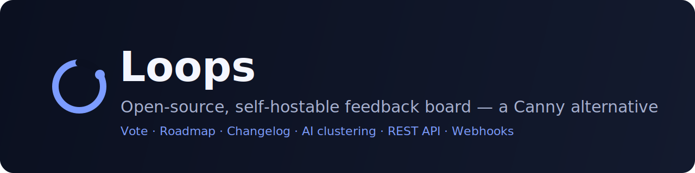
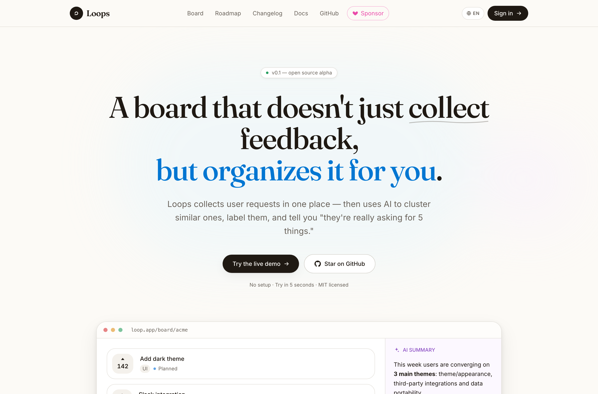
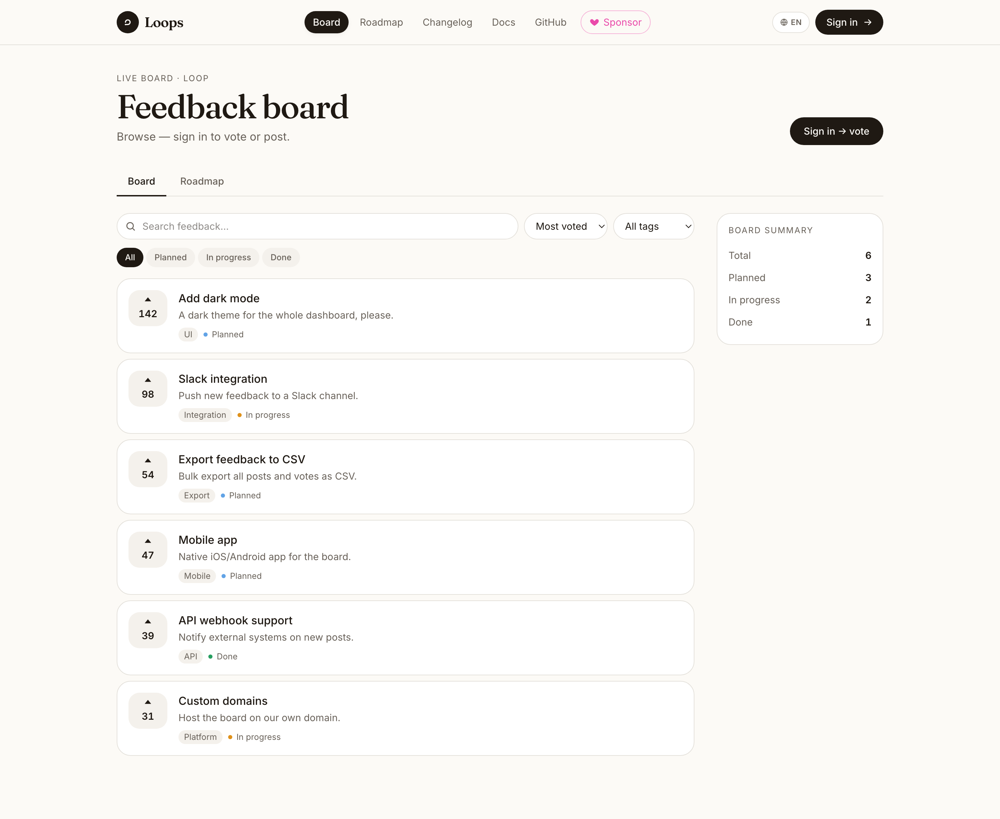

<p align="center">
  
</p>

<h1 align="center">Loops</h1>

<p align="center">
  <strong>An open-source, self-hostable feedback board — a Canny alternative.</strong><br/>
  Collect feature requests, let users vote and discuss, plan a roadmap, ship a public
  changelog, and let AI cluster and prioritize the noise for you.
</p>

<p align="center">
  <a href="#-quick-start-docker"></a>
  <a href="LICENSE"></a>
  
  
  
</p>

<p align="center">
  <a href="#-features">Features</a> ·
  <a href="#-ai-native-extras">AI extras</a> ·
  <a href="#-quick-start-docker">Quick start</a> ·
  <a href="#-local-development">Development</a> ·
  <a href="#-configuration">Configuration</a> ·
  <a href="#-public-api">API</a> ·
  <a href="#-contributing">Contributing</a>
</p>

---

## Why Loops?

Most feedback tools just **collect** requests and leave you to drown in them. Loops is
**AI-native**: as feedback comes in it detects duplicates, can turn a vague chat into a
clean post, and drafts your roadmap for you — all on infrastructure you own (just
**Node + Postgres**, no proprietary backend, no per-seat pricing).

> [!NOTE]
> Loops is fully self-hostable and ships with zero vendor lock-in. Bring your own
> Postgres and (optionally) your own AI provider key.

## ✨ Features

- 📋 **Feedback board** — post requests, upvote, filter, search and sort
- 🗺️ **Roadmap** — planned / in progress / shipped columns
- 📰 **Changelog** — shipped items grouped by month, shareable
- 💬 **Comments** — discuss posts; admins can mark official responses
- 🔐 **Auth** — email/password + optional Google & GitHub OAuth (cookie sessions)
- 🔑 **Public REST API** with scoped API keys (`/api/v1/*`)
- 🪝 **Webhooks** — HMAC-signed delivery on post/vote events
- 🌍 **i18n** — English & Turkish out of the box
- 🧩 **Embeddable widget** — drop feedback capture into any site with one script tag

## 🤖 AI-native extras

These are what set Loops apart from a classic Canny clone — and they work with **any**
provider (OpenAI, Anthropic or Google):

- 🪄 **AI duplicate detection** — the composer surfaces similar existing posts as you
  type, so users upvote instead of opening duplicates.
- 💬 **Conversational capture** — an AI assistant asks clarifying questions and turns a
  vague problem into a clean, de-duplicated post.
- 🧭 **AI roadmap generator** — admins auto-sort the top requests into **Now / Next /
  Later** with one click.
- 🧠 **AI Insights** — cluster, summarize and prioritize all feedback into themes.

## 🛠️ Tech stack

| Concern          | Choice                                                                 |
| ---------------- | ---------------------------------------------------------------------- |
| Framework        | [TanStack Start](https://tanstack.com/start) (React 19) + Vite + nitro |
| Database         | PostgreSQL                                                             |
| ORM / migrations | [Drizzle](https://orm.drizzle.team)                                    |
| Auth             | [better-auth](https://better-auth.com) (cookie sessions)               |
| Styling          | Tailwind CSS v4 + Radix UI                                             |
| AI               | [Vercel AI SDK](https://sdk.vercel.ai) (provider-agnostic)             |

> **Architecture note:** the browser never talks to the database directly. All data
> access goes through TanStack **server functions** and the REST API; authorization is
> enforced in the application layer (`src/lib/authz.ts`). See [AGENTS.md](AGENTS.md) for
> the conventions contributors should follow.

## 📸 Screenshots

|                                                       |                                                       |
| ----------------------------------------------------- | ----------------------------------------------------- |
|  |  |
| _Landing_                                             | _Feedback board_                                      |

## 🚀 Quick start (Docker)

The fastest way to run the whole stack (app + Postgres):

```bash
git clone https://github.com/selmansenol/loops.git
cd loops
cp .env.example .env
# Set a real secret:  openssl rand -base64 32  → BETTER_AUTH_SECRET
docker compose up --build
```

Open **http://localhost:3000**. Migrations run automatically on boot.

## 💻 Local development

Requires **Node 22+** and a running Postgres.

```bash
npm install
cp .env.example .env          # point DATABASE_URL at your Postgres

npm run db:migrate            # create tables + functions/triggers
npm run dev                   # http://localhost:3000
```

No local Postgres? Spin one up with Docker:

```bash
docker run -d --name loop-pg -p 5432:5432 \
  -e POSTGRES_PASSWORD=postgres -e POSTGRES_DB=loop postgres:16-alpine
```

### Scripts

| Script                            | What it does                                           |
| --------------------------------- | ------------------------------------------------------ |
| `npm run dev`                     | Start the dev server                                   |
| `npm run build`                   | Production build (`.output/`, node-server preset)      |
| `npm start`                       | Run the built server (`node .output/server/index.mjs`) |
| `npm run db:generate`             | Generate a migration from `src/db/schema.ts`           |
| `npm run db:migrate`              | Apply migrations + `src/db/triggers.sql`               |
| `npm run db:studio`               | Open Drizzle Studio                                    |
| `npm run lint` / `npm run format` | Lint / format                                          |

## ⚙️ Configuration

All configuration is via environment variables — see [`.env.example`](.env.example).

| Variable                                                                | Required | Description                                        |
| ----------------------------------------------------------------------- | -------- | -------------------------------------------------- |
| `DATABASE_URL`                                                          | ✅       | Postgres connection string                         |
| `BETTER_AUTH_SECRET`                                                    | ✅       | Random 32+ byte secret (`openssl rand -base64 32`) |
| `BETTER_AUTH_URL`                                                       | ✅       | Public base URL (OAuth callbacks, cookies)         |
| `GOOGLE_CLIENT_ID` / `GOOGLE_CLIENT_SECRET`                             | –        | Enable Google login                                |
| `GITHUB_CLIENT_ID` / `GITHUB_CLIENT_SECRET`                             | –        | Enable GitHub login                                |
| `OPENAI_API_KEY` / `ANTHROPIC_API_KEY` / `GOOGLE_GENERATIVE_AI_API_KEY` | –        | AI features (also settable in Settings → AI)       |
| `LOOP_AI_PROVIDER` / `LOOP_AI_MODEL`                                    | –        | Force a specific AI provider/model                 |

OAuth callback URLs to register with each provider:

```
<BETTER_AUTH_URL>/api/auth/callback/google
<BETTER_AUTH_URL>/api/auth/callback/github
```

### Make yourself an admin

Admin-only features (status changes, AI tools, API keys, webhooks) need an `admin` row
in `user_roles`. After signing up:

```sql
INSERT INTO user_roles (user_id, role)
SELECT id, 'admin' FROM "user" WHERE email = 'you@example.com';
```

(`npm run db:studio` is a convenient way to run this.)

## 🔌 Public API

Authenticate with an API key (created in **Settings → API Keys**) via
`Authorization: Bearer <key>`.

```bash
# List posts
curl -H "Authorization: Bearer loop_sk_..." http://localhost:3000/api/v1/posts

# Create a post (requires the `write` scope)
curl -X POST http://localhost:3000/api/v1/posts \
  -H "Authorization: Bearer loop_sk_..." \
  -H "Content-Type: application/json" \
  -d '{"title":"Dark mode please","description":"It would be great"}'

# Vote on behalf of an external user
curl -X POST http://localhost:3000/api/v1/posts/<id>/vote \
  -H "Authorization: Bearer loop_sk_..." \
  -H "X-Loop-External-User: user-123"
```

## 🌐 Deploy to production

Loops is a standard Node server (`node .output/server/index.mjs`) + a Postgres
database — host it anywhere (a VPS, Fly.io, Railway, Render, your own box…).

**With your own domain (e.g. `feedback.yourdomain.com`):**

1. Point the domain at your server and terminate TLS (HTTPS) with a reverse proxy
   (Caddy, Nginx, Traefik) or your host's built-in TLS.
2. Set the production environment:
   ```bash
   DATABASE_URL="postgres://…/loops"
   BETTER_AUTH_SECRET="…"                       # openssl rand -base64 32
   BETTER_AUTH_URL="https://feedback.yourdomain.com"   # your public URL
   ```
3. If you use OAuth, register these callback URLs with each provider:
   ```
   https://feedback.yourdomain.com/api/auth/callback/google
   https://feedback.yourdomain.com/api/auth/callback/github
   ```
4. Run it. Easiest is Docker Compose (app + Postgres):
   ```bash
   docker compose up -d --build
   ```
   Or build and run on a Node host directly: `npm ci && npm run build && npm run db:migrate && npm start`.

### One-command HTTPS (Caddy)

For a single server with your own domain, [`docker-compose.prod.yml`](docker-compose.prod.yml)
runs **app + Postgres + Caddy** with **automatic Let's Encrypt HTTPS**:

```bash
# On the server, after pointing your domain's A record at it:
cp .env.example .env            # set BETTER_AUTH_URL, BETTER_AUTH_SECRET, POSTGRES_PASSWORD
# edit the domain in ./Caddyfile
docker compose -f docker-compose.prod.yml up -d --build
```

Caddy obtains and renews TLS certificates automatically (ports 80/443 must be open).

> [!IMPORTANT]
> `BETTER_AUTH_URL` **must** match the public HTTPS URL, or sign-in cookies and
> OAuth redirects will fail. Always serve production over HTTPS.

## 🗺️ Roadmap

- [ ] Email notifications (Resend)
- [ ] Multi-board / workspace support
- [ ] Semantic (embedding-based) duplicate detection
- [ ] Two-way GitHub / Linear / Jira sync
- [ ] More locales

Have an idea? [Open an issue](../../issues/new/choose) — Loops is built on feedback. 🙂

## 🤝 Contributing

Contributions are very welcome! Please read [CONTRIBUTING.md](CONTRIBUTING.md) and our
[Code of Conduct](CODE_OF_CONDUCT.md). Good first steps:

1. Fork & clone, then follow [Local development](#-local-development).
2. Run `npm run lint` and `npm run build` before opening a PR.
3. Keep user-facing strings in both locales (`src/lib/i18n.ts`).

## 💛 Sponsors & Support

Loops is free and open-source (MIT). If it saves you time or money, please consider
sponsoring — it directly funds bug fixes and new features, and keeps the project
independent.

<p>
  <a href="https://github.com/sponsors/selmansenol">
    
  </a>
</p>

> _Loops ücretsiz ve açık kaynak. İşine yaradıysa [GitHub Sponsors](https://github.com/sponsors/selmansenol) ile destek olabilirsin._ 🙏

**Be the first sponsor** and your name/logo can appear here. 💖

## 🔒 Security

Found a vulnerability? Please **don't** open a public issue — see
[SECURITY.md](SECURITY.md) for private disclosure.

## 📄 License

[MIT](LICENSE) © Loops contributors.
